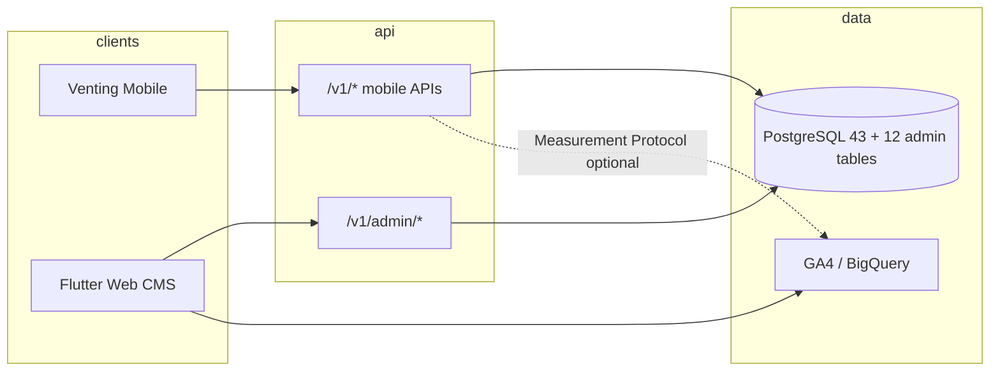

# Venting Admin Portal (CMS) — Full Spec

> **Product:** Flutter Web admin CMS for Venting  
> **Companions:** [`database-schema.md`](./database-schema.md) · [`api-endpoints.md`](./api-endpoints.md) · [`api-usage-guide.md`](./api-usage-guide.md)  
> **Purpose:** Define how ops/admins manage the mobile app — users, approvals, content, money, safety, and analytics.

---

## 1. What this portal is

A **Flutter Web CMS** used only by internal staff (ops, support, finance, content, super-admin). It talks to a dedicated **Admin API** (`/v1/admin/...`) on the same backend as the mobile app, against the **same PostgreSQL database**, plus a small set of **admin-only tables**.

| Item | Decision |
|------|----------|
| Client | Flutter Web (desktop-first layouts; tablet OK) |
| Backend | Same Nest/Node/Go API service; separate `admin` route prefix + auth |
| Auth | Admin accounts **not** in mobile `users` role enum — separate `admin_users` |
| Mobile APIs | **Never** call `/v1/auth/*` mobile register from the portal for customer ops |
| Analytics | Google Analytics 4 (GA4) in the portal UI + optional BigQuery / Measurement Protocol for product events |

**Out of scope for v1:** building the VoIP provider console, editing raw call recordings, or running SQL from the UI.

---

## 2. Portal modules (what you manage)

| Module | What admins do | Mobile impact |
|--------|----------------|---------------|
| **Dashboard** | KPIs, charts, alerts queue | Read-only aggregates |
| **Listener review** | Approve / reject profiles & identity docs | Sets `listener_profiles.profile_status` |
| **Users** | Search ventors/listeners, suspend, force logout, soft-delete | `users.is_active`, `deleted_at` |
| **Sessions** | Inspect bookings, cancel/refund edge cases | `sessions`, `session_payments` |
| **Reports & safety** | Triage `session_reports`, ban/warn | User flags + notifications |
| **Earnings & payouts** | Approve/reject payouts, adjust wallet | `payouts`, ledger adjustments |
| **Catalogs** | Languages (**one** speaking-language table with `flag_emoji` / `flag_url`), comfort areas / interests (with `icon_emoji` / `icon_url`), experiences, boundaries | Lookup tables used by registration |
| **Rewards & promo** | CRUD offers, promo codes | Rewards tab + checkout |
| **Training** | Modules, content URLs, force complete | Listener training sheet |
| **Achievements** | Catalog + optional grant | Ventor achievements |
| **Notifications** | Broadcast system pushes | `notifications` + FCM |
| **App config** | Feature flags, tier rates, support links | Remote config for mobile |
| **CMS content** | Help articles, banners, legal version notes | WebViews / in-app links |
| **Admins & roles** | Invite staff, RBAC | Portal-only |
| **Audit log** | Who changed what | Compliance |
| **Analytics** | Embed GA4 + product metrics | Marketing / growth |

---

## 3. Architecture overview



| Layer | Responsibility |
|-------|----------------|
| Flutter Web | Screens, charts, file preview (ID docs), role-gated menus |
| Admin API | AuthZ (RBAC), pagination, bulk actions, audit writes |
| Shared DB | All mobile tables + admin tables |
| GA4 | Traffic, funnels, portal page views; product events from backend |

**Security baseline**

- Admin JWT separate issuer/audience from mobile tokens  
- MFA required for `super_admin` and `finance`  
- IP allowlist optional in production  
- All mutating admin calls write `admin_audit_logs`  
- PII (ID docs, IBANs) masked unless role has `pii:read`

---

## 4. Database — what you already have vs what to add

### 4.1 Existing mobile schema (reuse — do not duplicate)

From [`database-schema.md`](./database-schema.md): **44 tables**.

Portal **reads/writes** these heavily:

| Domain | Tables portal uses |
|--------|-------------------|
| Users | `users`, `refresh_tokens` |
| Profiles | `ventor_profiles`, `listener_profiles`, `listener_identity_verifications` |
| Lookups | `languages`, `comfort_areas`, `life_experiences`, `boundaries` |
| Sessions | `session_requests`, `sessions`, `session_payments`, ratings, feedback, `session_reports` |
| Money | `listener_wallets`, `wallet_ledger_entries`, `payout_methods`, `payouts` |
| Growth | `reward_offers`, `reward_trades`, `invite_*`, `promo_*` |
| Ops | `notifications`, `training_modules`, `listener_training_progress`, `achievements` |

### 4.2 New tables for the CMS — **add 12**

| # | Table | Purpose |
|--:|-------|---------|
| 44 | `admin_users` | Staff login accounts |
| 45 | `admin_roles` | Role definitions (`super_admin`, `ops`, `support`, `finance`, `content`, `analyst`) |
| 46 | `admin_user_roles` | Many-to-many staff ↔ roles |
| 47 | `admin_permissions` | Fine-grained permission keys |
| 48 | `admin_role_permissions` | Role ↔ permission |
| 49 | `admin_audit_logs` | Immutable action history |
| 50 | `admin_notes` | Internal notes on a user/session/report |
| 51 | `app_feature_flags` | Remote flags for mobile |
| 52 | `app_config_kv` | Key/value config (tier rates, fees, etc.) |
| 53 | `cms_pages` | Marketing / optional CMS HTML (not the 6 static legal/help pages) |
| 54 | `cms_banners` | In-app or portal promo banners |
| 55 | `moderation_actions` | Warn / suspend / ban history (normalized) |

**Optional later (not in v1 count):** `admin_sessions`, `export_jobs`, `ga_synced_metrics` cache.

### 4.3 Totals

| Metric | Count |
|--------|------:|
| Existing mobile tables | **43** |
| **New CMS tables** | **12** |
| **Grand total tables** | **55** |

---

## 5. New table designs (CMS)

### Shared enums (admin)

| Enum | Values |
|------|--------|
| `admin_status` | `active`, `invited`, `disabled` |
| `moderation_action_type` | `warn`, `suspend`, `unsuspend`, `ban`, `unban`, `force_logout` |
| `review_decision` | `approved`, `rejected`, `needs_more_info` |
| `cms_page_status` | `draft`, `published`, `archived` |
| `banner_placement` | `ventor_home`, `listener_home`, `checkout`, `global` |

---

### 44. `admin_users`

| Column | Type | Notes |
|--------|------|-------|
| `id` | UUID | **PK** |
| `email` | VARCHAR(255) | **UQ** |
| `password_hash` | VARCHAR(255) | |
| `full_name` | VARCHAR(120) | |
| `status` | `admin_status` | |
| `mfa_enabled` | BOOLEAN | default false |
| `mfa_secret_encrypted` | TEXT | ? |
| `last_login_at` | TIMESTAMPTZ | ? |
| `created_at` | TIMESTAMPTZ | |
| `updated_at` | TIMESTAMPTZ | |
| `disabled_at` | TIMESTAMPTZ | ? |

---

### 45–48. RBAC (`admin_roles`, `admin_user_roles`, `admin_permissions`, `admin_role_permissions`)

**Seed roles**

| Role | Typical access |
|------|----------------|
| `super_admin` | Everything |
| `ops` | Approvals, users, sessions, reports |
| `support` | Users read, notes, limited suspend |
| `finance` | Payouts, wallet adjustments, earnings |
| `content` | Catalogs, CMS pages, banners, training |
| `analyst` | Dashboard + analytics (read-only) |

**Permission keys (examples)**

`users:read`, `users:write`, `listeners:approve`, `identity:read`, `sessions:write`, `reports:triage`, `payouts:approve`, `wallet:adjust`, `catalogs:write`, `rewards:write`, `promo:write`, `cms:write`, `config:write`, `admins:manage`, `audit:read`, `analytics:read`

---

### 49. `admin_audit_logs`

| Column | Type | Notes |
|--------|------|-------|
| `id` | UUID | **PK** |
| `admin_user_id` | UUID | **FK → admin_users** |
| `action` | VARCHAR(64) | e.g. `listener.approve` |
| `entity_type` | VARCHAR(64) | `listener`, `payout`, `promo`… |
| `entity_id` | VARCHAR(64) | |
| `before` | JSONB | ? |
| `after` | JSONB | ? |
| `ip` | INET | ? |
| `user_agent` | TEXT | ? |
| `created_at` | TIMESTAMPTZ | **IDX** |

Append-only. Never update/delete from app code.

---

### 50. `admin_notes`

| Column | Type | Notes |
|--------|------|-------|
| `id` | UUID | **PK** |
| `admin_user_id` | UUID | **FK** |
| `entity_type` | VARCHAR(64) | `user`, `session`, `report`, `payout` |
| `entity_id` | UUID | |
| `body` | TEXT | |
| `created_at` | TIMESTAMPTZ | |
| `updated_at` | TIMESTAMPTZ | |

---

### 51. `app_feature_flags`

| Column | Type | Notes |
|--------|------|-------|
| `key` | VARCHAR(64) | **PK** e.g. `instant_match_enabled` |
| `description` | TEXT | |
| `enabled` | BOOLEAN | |
| `rollout_percent` | INT | 0–100 |
| `audience` | VARCHAR(32) | `all` \| `ventor` \| `listener` |
| `updated_by` | UUID | ? FK admin |
| `updated_at` | TIMESTAMPTZ | |

Mobile fetches via a small public/config endpoint or remote-config SDK.

---

### 52. `app_config_kv`

| Column | Type | Notes |
|--------|------|-------|
| `key` | VARCHAR(64) | **PK** |
| `value` | JSONB | |
| `updated_by` | UUID | ? |
| `updated_at` | TIMESTAMPTZ | |

Examples: `earnings_tiers`, `voice_change_fee`, `min_payout_amount`, `support_email`.


### 53. `cms_pages`
### 53. `cms_pages`

| Column | Type | Notes |
|--------|------|-------|
| `id` | UUID | **PK** |
| `slug` | VARCHAR(120) | **UQ** e.g. `help/cancel-session` |
| `title` | VARCHAR(200) | |
| `locale` | VARCHAR(8) | `en`, `ar` |
| `body_markdown` | TEXT | |
| `status` | `cms_page_status` | |
| `published_at` | TIMESTAMPTZ | ? |
| `updated_by` | UUID | ? |
| `created_at` | TIMESTAMPTZ | |
| `updated_at` | TIMESTAMPTZ | |

**UQ:** `(slug, locale)`

---

### 54. `cms_banners`

| Column | Type | Notes |
|--------|------|-------|
| `id` | UUID | **PK** |
| `title` | VARCHAR(120) | |
| `body` | TEXT | |
| `cta_label` | VARCHAR(64) | ? |
| `cta_url` | TEXT | ? |
| `placement` | `banner_placement` | |
| `audience` | VARCHAR(32) | |
| `starts_at` | TIMESTAMPTZ | |
| `ends_at` | TIMESTAMPTZ | ? |
| `is_active` | BOOLEAN | |
| `created_at` | TIMESTAMPTZ | |

---

### 55. `moderation_actions`

| Column | Type | Notes |
|--------|------|-------|
| `id` | UUID | **PK** |
| `user_id` | UUID | **FK → users** |
| `admin_user_id` | UUID | **FK → admin_users** |
| `action` | `moderation_action_type` | |
| `reason` | TEXT | |
| `starts_at` | TIMESTAMPTZ | |
| `ends_at` | TIMESTAMPTZ | ? suspend window |
| `related_report_id` | UUID | ? FK `session_reports` |
| `created_at` | TIMESTAMPTZ | |

Also set `users.is_active = false` on ban/suspend.

---

### Small schema tweaks on existing tables (recommended)

| Table | Add | Why |
|-------|-----|-----|
| `listener_identity_verifications` | `reviewed_by_admin_id` UUID? | Who approved ID |
| `listener_profiles` | `reviewed_by_admin_id`, `reviewed_at`, `rejection_reason` | Portal review UX |
| `session_reports` | `assigned_admin_id`, `resolved_at`, `resolution_note` | Triage queue |
| `payouts` | `reviewed_by_admin_id`, `admin_note` | Finance approval |
| `users` | `suspended_until` TIMESTAMPTZ? | Timed suspensions |

These are **columns**, not new tables.

---

## 6. Admin API — how many endpoints?

### Summary count

| Area | Endpoints |
|------|----------:|
| Admin auth | 5 |
| Dashboard / stats | 6 |
| Users (ventor + listener) | 10 |
| Listener review / identity | 6 |
| Sessions | 6 |
| Reports & moderation | 7 |
| Payouts & wallet | 7 |
| Catalogs (CRUD-ish) | 8 |
| Rewards & promo | 8 |
| Training & achievements | 6 |
| Notifications (broadcast) | 3 |
| Feature flags & config | 6 |
| CMS pages & banners | 8 |
| Admins / RBAC | 7 |
| Audit & notes | 4 |
| Analytics helpers | 3 |
| **Total Admin APIs** | **≈ 100** |

Practical delivery:

| Phase | Endpoints | Goal |
|-------|----------:|------|
| **MVP** | **~45** | Login, dashboard, listener approve, users, reports, payouts list/approve, audit |
| **v1 complete** | **~100** | Full CMS as below |
| Mobile public APIs (unchanged) | **73** | App contract stays |

**Grand API surface for the product:** ~**173** (73 mobile + ~100 admin). Admin never replaces mobile endpoints.

All admin routes: prefix `/v1/admin`, auth `Authorization: Bearer {adminAccessToken}`, require permission checks.

---

## 7. Admin endpoints (by module)

### 7.1 Admin auth (5)

| # | Method | Path | Use |
|--:|--------|------|-----|
| A1 | `POST` | `/v1/admin/auth/login` | Portal login |
| A2 | `POST` | `/v1/admin/auth/refresh` | Token refresh |
| A3 | `POST` | `/v1/admin/auth/logout` | Logout |
| A4 | `GET` | `/v1/admin/auth/me` | Current admin + permissions |
| A5 | `POST` | `/v1/admin/auth/change-password` | Staff password change |

*(Invite accept / MFA setup can be A5b/A5c in a later pass.)*

---

### 7.2 Dashboard & statistics (6)

| # | Method | Path | Use |
|--:|--------|------|-----|
| A6 | `GET` | `/v1/admin/stats/overview` | KPI cards: users, sessions today, GMV, pending reviews, open reports |
| A7 | `GET` | `/v1/admin/stats/users` | Signups by day/role; active vs suspended |
| A8 | `GET` | `/v1/admin/stats/sessions` | Booked / completed / cancelled / missed trends |
| A9 | `GET` | `/v1/admin/stats/revenue` | Payments, tips, refunds, discounts |
| A10 | `GET` | `/v1/admin/stats/listeners` | Online now, by tier, by country, approval funnel |
| A11 | `GET` | `/v1/admin/stats/wellness` | Mood check-in distribution (aggregated, privacy-safe) |

Query params: `from`, `to`, `granularity` (`day`\|`week`\|`month`).

---

### 7.3 Users (10)

| # | Method | Path | Use |
|--:|--------|------|-----|
| A12 | `GET` | `/v1/admin/users` | Search/filter: role, status, email, date |
| A13 | `GET` | `/v1/admin/users/{userId}` | Full dossier (profile + counts) |
| A14 | `PATCH` | `/v1/admin/users/{userId}` | Update limited fields (email rare; flags) |
| A15 | `POST` | `/v1/admin/users/{userId}/suspend` | Timed or indefinite suspend |
| A16 | `POST` | `/v1/admin/users/{userId}/unsuspend` | Restore |
| A17 | `POST` | `/v1/admin/users/{userId}/ban` | Permanent ban |
| A18 | `POST` | `/v1/admin/users/{userId}/force-logout` | Revoke all refresh tokens |
| A19 | `GET` | `/v1/admin/ventors` | Ventor list + points/sessions filters |
| A20 | `GET` | `/v1/admin/ventors/{ventorId}` | Ventor detail |
| A21 | `GET` | `/v1/admin/listeners` | Listener list + `profile_status` filter |

---

### 7.4 Listener review & identity (6)

| # | Method | Path | Use |
|--:|--------|------|-----|
| A22 | `GET` | `/v1/admin/listeners/queue` | `under_review` queue (sorted oldest first) |
| A23 | `GET` | `/v1/admin/listeners/{listenerId}` | Full profile + tags + availability summary |
| A24 | `GET` | `/v1/admin/listeners/{listenerId}/identity` | ID docs + selfie URLs (signed) |
| A25 | `POST` | `/v1/admin/listeners/{listenerId}/approve` | Set `approved`, `is_verified` |
| A26 | `POST` | `/v1/admin/listeners/{listenerId}/reject` | Body: `reason`, optional `needs_more_info` |
| A27 | `POST` | `/v1/admin/identity/{verificationId}/decide` | Approve/reject a verification attempt |

On approve: update `listener_profiles.profile_status`, push notification to listener, audit log.

---

### 7.5 Sessions (6)

| # | Method | Path | Use |
|--:|--------|------|-----|
| A28 | `GET` | `/v1/admin/sessions` | Filter status, date, user |
| A29 | `GET` | `/v1/admin/sessions/{sessionId}` | Detail + payment + ratings |
| A30 | `POST` | `/v1/admin/sessions/{sessionId}/cancel` | Admin cancel |
| A31 | `POST` | `/v1/admin/sessions/{sessionId}/refund` | Full/partial refund |
| A32 | `GET` | `/v1/admin/session-requests` | Pending/expired requests debug |
| A33 | `GET` | `/v1/admin/sessions/{sessionId}/timeline` | Status history if you store events (or derived) |

---

### 7.6 Reports & moderation (7)

| # | Method | Path | Use |
|--:|--------|------|-----|
| A34 | `GET` | `/v1/admin/reports` | Open / reviewed / closed |
| A35 | `GET` | `/v1/admin/reports/{reportId}` | Detail |
| A36 | `PATCH` | `/v1/admin/reports/{reportId}` | Assign, status, resolution note |
| A37 | `POST` | `/v1/admin/moderation` | Create warn/suspend/ban |
| A38 | `GET` | `/v1/admin/moderation` | History by user |
| A39 | `GET` | `/v1/admin/ratings` | Flagged low ratings / review text search |
| A40 | `GET` | `/v1/admin/feedback` | Listener feedback list |

---

### 7.7 Payouts & wallet (7)

| # | Method | Path | Use |
|--:|--------|------|-----|
| A41 | `GET` | `/v1/admin/payouts` | Pending queue |
| A42 | `GET` | `/v1/admin/payouts/{payoutId}` | Detail + method (masked) |
| A43 | `POST` | `/v1/admin/payouts/{payoutId}/approve` | Mark completed + reference |
| A44 | `POST` | `/v1/admin/payouts/{payoutId}/reject` | Fail + restore balance |
| A45 | `GET` | `/v1/admin/listeners/{listenerId}/wallet` | Balances + ledger page |
| A46 | `POST` | `/v1/admin/listeners/{listenerId}/wallet/adjust` | Manual credit/debit (`adjustment`) |
| A47 | `GET` | `/v1/admin/earnings/tiers` | Read tier config (or from `app_config_kv`) |

---

### 7.8 Catalogs (8)

> Portal owns the **same** lookup tables the mobile app reads via `#74` / `#75`.  
> Do **not** create a separate “speaking languages” catalog — ventor + listener both use `languages`.

| # | Method | Path | Use |
|--:|--------|------|-----|
| A48 | `GET` | `/v1/admin/catalog/languages` | List all languages (incl. inactive) |
| A49 | `PUT` | `/v1/admin/catalog/languages/{id}` | Upsert / deactivate; body includes names + `sort_order` + `is_active` |
| A49b | `POST` | `/v1/admin/catalog/languages/{id}/flag` | Multipart image upload → store CDN URL on `languages.flag_url` |
| A50 | `GET`/`PUT` | `/v1/admin/catalog/comfort-areas`… | Same pattern for interests / comfort categories |
| A50b | `POST` | `/v1/admin/catalog/comfort-areas/{id}/icon` | Multipart image upload → store CDN URL on `comfort_areas.icon_url` |
| A51 | `GET`/`PUT` | `/v1/admin/catalog/life-experiences`… | Same |
| A52 | `GET`/`PUT` | `/v1/admin/catalog/boundaries`… | Same |

Count as **8** if each catalog has list + upsert (4×2). Collapse to fewer with a generic `/catalog/{type}` if preferred. Flag/icon upload endpoints can share a generic `POST /v1/admin/media` that returns `{ url }` then attach via PUT.

#### Portal UX — Languages

| Field | Edit |
|-------|------|
| `id` | Create-only (immutable after seed) |
| `name_en` / `name_native` / `name_ar` | Text |
| `flag_url` | Image upload preview (required before activate) |
| `sort_order` | Number |
| `is_active` | Toggle |

Used by: ventor registration language step, listener registration languages, discovery language filters.

#### Portal UX — Comfort areas / interests

| Field | Edit |
|-------|------|
| `id` | Create-only |
| `name_en` / `name_ar` | Text |
| `icon_emoji` | Text / emoji picker (required before activate) |
| `icon_url` | Optional image upload preview |
| `audience` | `ventor` / `listener` / `all` |
| `allows_custom_text` | Toggle (e.g. `other`) |
| `sort_order` | Number |
| `is_active` | Toggle |

Used by: ventor registration interests step (`audience=ventor`), listener comfort tags.

---

### 7.9 Rewards & promo (8)

| # | Method | Path | Use |
|--:|--------|------|-----|
| A53 | `GET` | `/v1/admin/reward-offers` | List |
| A54 | `POST` | `/v1/admin/reward-offers` | Create |
| A55 | `PATCH` | `/v1/admin/reward-offers/{id}` | Update / deactivate |
| A56 | `GET` | `/v1/admin/reward-trades` | Redemption audit |
| A57 | `GET` | `/v1/admin/promo-codes` | List |
| A58 | `POST` | `/v1/admin/promo-codes` | Create |
| A59 | `PATCH` | `/v1/admin/promo-codes/{id}` | Update |
| A60 | `GET` | `/v1/admin/promo-codes/{id}/redemptions` | Usage |

---

### 7.10 Training & achievements (6)

| # | Method | Path | Use |
|--:|--------|------|-----|
| A61 | `GET`/`PUT` | `/v1/admin/training-modules` | Manage curriculum |
| A62 | `GET` | `/v1/admin/listeners/{id}/training` | Progress |
| A63 | `POST` | `/v1/admin/listeners/{id}/training/{moduleId}/complete` | Force complete |
| A64 | `GET`/`PUT` | `/v1/admin/achievements` | Catalog |
| A65 | `POST` | `/v1/admin/ventors/{id}/achievements/{achievementId}` | Grant |
| A66 | `GET` | `/v1/admin/invite-stats` | Invite program performance |

---

### 7.11 Notifications (3)

| # | Method | Path | Use |
|--:|--------|------|-----|
| A67 | `POST` | `/v1/admin/notifications/broadcast` | Segment: all / role / user ids |
| A68 | `GET` | `/v1/admin/notifications` | Sent history |
| A69 | `POST` | `/v1/admin/notifications/user/{userId}` | Single user system message |

---

### 7.12 Feature flags & config (6)

| # | Method | Path | Use |
|--:|--------|------|-----|
| A70 | `GET` | `/v1/admin/feature-flags` | List |
| A71 | `PUT` | `/v1/admin/feature-flags/{key}` | Upsert |
| A72 | `GET` | `/v1/admin/config` | All KV |
| A73 | `PUT` | `/v1/admin/config/{key}` | Upsert JSON value |
| A74 | `GET` | `/v1/admin/config/earnings-tiers` | Typed helper |
| A75 | `PUT` | `/v1/admin/config/earnings-tiers` | Update tier table |

---

### 7.13 CMS pages & banners (8)

| # | Method | Path | Use |
|--:|--------|------|-----|
| A76 | `GET` | `/v1/admin/cms/pages` | List |
| A77 | `POST` | `/v1/admin/cms/pages` | Create |
| A78 | `PATCH` | `/v1/admin/cms/pages/{id}` | Update |
| A79 | `POST` | `/v1/admin/cms/pages/{id}/publish` | Publish |
| A80 | `GET` | `/v1/admin/cms/banners` | List |
| A81 | `POST` | `/v1/admin/cms/banners` | Create |
| A82 | `PATCH` | `/v1/admin/cms/banners/{id}` | Update |
| A83 | `DELETE` | `/v1/admin/cms/banners/{id}` | Soft deactivate |

Mobile may expose public `GET /v1/cms/pages/{slug}` and `GET /v1/cms/banners` (2 extra public endpoints — optional).

> **Static legal/help:** Terms, Privacy, and Help are **6 static HTML files** (EN/AR) hosted at `webContentBaseUrl` — see mobile [`docs/static-web/`](./static-web/README.md). Not portal CMS tables or mobile REST endpoints.

### 7.14 Admins
### 7.14 Admins & RBAC (7)

| # | Method | Path | Use |
|--:|--------|------|-----|
| A84 | `GET` | `/v1/admin/staff` | List staff |
| A85 | `POST` | `/v1/admin/staff` | Invite |
| A86 | `PATCH` | `/v1/admin/staff/{id}` | Roles / disable |
| A87 | `GET` | `/v1/admin/roles` | Roles |
| A88 | `PUT` | `/v1/admin/roles/{id}/permissions` | Edit permissions |
| A89 | `GET` | `/v1/admin/permissions` | Permission catalog |
| A90 | `POST` | `/v1/admin/staff/{id}/reset-password` | Ops reset |

---

### 7.15 Audit & notes (4)

| # | Method | Path | Use |
|--:|--------|------|-----|
| A91 | `GET` | `/v1/admin/audit-logs` | Filter by admin, entity, date |
| A92 | `GET` | `/v1/admin/notes` | By entity |
| A93 | `POST` | `/v1/admin/notes` | Add note |
| A94 | `PATCH` | `/v1/admin/notes/{id}` | Edit note |

---

### 7.16 Analytics helpers (3)

| # | Method | Path | Use |
|--:|--------|------|-----|
| A95 | `GET` | `/v1/admin/analytics/summary` | Server-side KPIs for portal (not GA) |
| A96 | `GET` | `/v1/admin/analytics/funnels` | Registration → approved → first session |
| A97 | `GET` | `/v1/admin/analytics/ga-embed-config` | Returns GA4 measurement ID + allowed embed tokens/config for the web app |

---

## 8. Flutter Web portal — screen map

| Route (suggested) | Screen | Primary APIs |
|-------------------|--------|--------------|
| `/login` | Admin login | A1 |
| `/` | Dashboard | A6–A11, A95 |
| `/reviews` | Listener approval queue | A22–A27 |
| `/users` | User directory | A12–A21 |
| `/users/:id` | User dossier + notes | A13, A92–A93, A37–A38 |
| `/sessions` | Sessions | A28–A33 |
| `/reports` | Safety queue | A34–A36 |
| `/payouts` | Finance | A41–A47 |
| `/catalogs` | Lookups — languages (`flag_emoji` / `flag_url`), comfort areas (`icon_emoji` / `icon_url`) | A48–A52 (+ media upload) |
| `/rewards` | Offers | A53–A56 |
| `/promos` | Promo codes | A57–A60 |
| `/training` | Modules | A61–A63 |
| `/achievements` | Achievements | A64–A65 |
| `/notifications` | Broadcast | A67–A69 |
| `/config` | Flags + KV | A70–A75 |
| `/cms/pages` | Optional CMS content | A76–A79 |
| `/cms/banners` | Banners | A80–A83 |
| *(static host)* | Terms / Privacy / Help EN+AR | Deploy `docs/static-web/` — not admin APIs |
| `/staff` | Admins | A84–A90 |
| `/audit` | Audit log | A91 |
| `/analytics` | GA + funnels | A95–A97 + GA4 |

**UX notes for Flutter Web**

- Desktop nav rail + dense data tables (`PaginatedDataTable` or custom)  
- Signed URL image/PDF viewers for identity docs  
- Confirm dialogs for approve/reject/refund/ban  
- Role-gated menus (hide routes without permission)

---

## 9. Google Analytics integration

### 9.1 What to use

| Piece | Tool | Where |
|-------|------|--------|
| Portal page views / UX | **GA4** Web tag | Flutter Web (`gtag` via JS interop or `google_analytics` package) |
| Marketing site (if any) | GA4 | Separate property or stream |
| Product events (mobile) | Firebase Analytics **or** GA4 Measurement Protocol | Mobile / backend |
| Deep analysis | GA4 → **BigQuery** export | Dashboards / Looker Studio |

### 9.2 Recommended properties

1. **Venting App (mobile)** — Firebase → GA4  
2. **Venting Admin Portal** — GA4 web stream (internal; filter staff IPs if needed)

### 9.3 Portal implementation steps

1. Create GA4 property + Web data stream → get `MEASUREMENT_ID` (`G-XXXX`)  
2. Inject gtag in `web/index.html` or load via Flutter JS interop after login  
3. Set **user_id** = admin UUID (hashed if policy requires)  
4. Send events: `page_view`, `listener_approved`, `payout_approved`, `report_resolved`  
5. Expose `A97` so measurement ID is not hard-coded per environment  
6. Optional: Looker Studio dashboard linked from `/analytics`

### 9.4 Events to track (portal)

| Event | Params |
|-------|--------|
| `admin_login` | role |
| `review_approve` / `review_reject` | listener_id |
| `payout_decide` | status, amount_bucket |
| `user_moderate` | action |
| `config_update` | key |
| `broadcast_sent` | audience_size_bucket |

### 9.5 Product analytics (app) — admin only consumes

Backend or mobile already should emit (to Firebase/GA4): `sign_up`, `listener_submit_review`, `session_booked`, `session_completed`, `reward_redeem`, `payout_requested`.

Admin **dashboard stats (A6–A11)** come from **Postgres**, not from GA — GA is for behavior/funnels; SQL is for money and ops queues.

---

## 10. RBAC matrix (who can do what)

| Capability | super | ops | support | finance | content | analyst |
|------------|:----:|:---:|:-------:|:-------:|:-------:|:-------:|
| Dashboard | ✓ | ✓ | ✓ | ✓ | ✓ | ✓ |
| Approve listeners | ✓ | ✓ | — | — | — | — |
| View ID docs | ✓ | ✓ | limited | — | — | — |
| Suspend / ban | ✓ | ✓ | warn only | — | — | — |
| Refund session | ✓ | ✓ | — | ✓ | — | — |
| Approve payout | ✓ | — | — | ✓ | — | — |
| Wallet adjust | ✓ | — | — | ✓ | — | — |
| Catalogs / CMS | ✓ | — | — | — | ✓ | — |
| Rewards / promo | ✓ | ✓ | — | — | ✓ | — |
| Feature flags | ✓ | ✓ | — | — | — | — |
| Manage staff | ✓ | — | — | — | — | — |
| Audit log | ✓ | ✓ | ✓ | ✓ | ✓ | ✓ |
| Analytics | ✓ | ✓ | ✓ | ✓ | ✓ | ✓ |

---

## 11. Critical admin workflows

### 11.1 Approve a listener

1. Open `/reviews` → `A22` queue  
2. Open dossier `A23` + identity `A24`  
3. `A25` approve **or** `A26` reject with reason  
4. System: update `profile_status`, notify listener, write `admin_audit_logs`  
5. Listener app: `#7 auth/me` shows `approved` → home

### 11.2 Triage a report

1. `A34` open reports → `A35` detail  
2. Optional `A37` warn/suspend/ban  
3. `A36` close report with note  
4. Audit + optional notification to reporter

### 11.3 Approve payout

1. Finance opens `A41` pending  
2. Verify wallet `A45`  
3. `A43` approve with bank reference **or** `A44` reject  
4. Ledger entry + listener notification

### 11.4 Ship a promo

1. Content/ops `A58` create code  
2. Mobile checkout already uses `#73 POST /v1/promo/validate`

---

## 12. Implementation phases

| Phase | Scope | Tables | Admin APIs |
|-------|--------|-------:|-----------:|
| **P0 — MVP** | Auth, dashboard, listener queue approve/reject, user search, reports list, audit | +`admin_*` RBAC + audit (6 tables) | ~45 |
| **P1** | Payouts, wallet adjust, sessions refund, moderation actions, notes | +`moderation_actions`, `admin_notes` | +20 |
| **P2** | Catalogs, rewards, promo, training, achievements | (reuse mobile catalogs) | +20 |
| **P3** | Feature flags, config, CMS pages/banners, GA embed | +flags, config, cms (4) | +15 |
| **P4** | Polish: MFA, exports, BigQuery, advanced funnels | optional | +rest → ~100 |

---

## 13. Final numbers (cheat sheet)

| Item | Count |
|------|------:|
| Mobile app REST APIs (existing spec) | **73** |
| **New Admin/CMS REST APIs** | **≈ 100** (MVP ~45) |
| **Optional public CMS read APIs for mobile** | **+2** |
| Existing DB tables | **43** |
| **New DB tables for portal** | **12** |
| **Total DB tables** | **55** |
| Recommended column patches on existing tables | **~5 tables** |
| Portal top-level modules / main screens | **~18** |
| Staff roles | **6** |
| GA4 properties | **2** (app + admin) |

---

## 14. Suggested Flutter Web project layout

```
venting_admin_portal/
  lib/
    main.dart
    app.dart
    core/           # dio, auth, router, theme
    features/
      auth/
      dashboard/
      reviews/
      users/
      sessions/
      reports/
      payouts/
      catalogs/
      rewards/
      promos/
      training/
      cms/
      config/
      staff/
      audit/
      analytics/
    shared/         # tables, charts, confirm dialogs
  web/
    index.html      # GA4 snippet hook
```

Share DTOs / OpenAPI with the mobile backend; do **not** import mobile UI packages.

---

## 15. Non-goals & guardrails

- Do not let the portal use mobile ventor/listener JWTs  
- Do not store ID document bytes in the CMS DB — store object-storage URLs + short-lived signed GET  
- Do not show full IBAN/PayPal to non-finance roles  
- Do not delete financial rows — reverse with ledger adjustments  
- Do not treat GA as source of truth for payouts or approvals  

---

## 16. Related docs

| Doc | Role |
|-----|------|
| [`database-schema.md`](./database-schema.md) | Mobile 44 tables |
| [`api-endpoints.md`](./api-endpoints.md) | Mobile 73 APIs |
| [`api-usage-guide.md`](./api-usage-guide.md) | Where mobile calls APIs |
| **This doc** | CMS product, +12 tables, ~100 admin APIs, GA |

---

*Designed so one PostgreSQL database serves mobile + Flutter Web CMS, with a hard auth and RBAC boundary between `/v1/*` and `/v1/admin/*`.*
